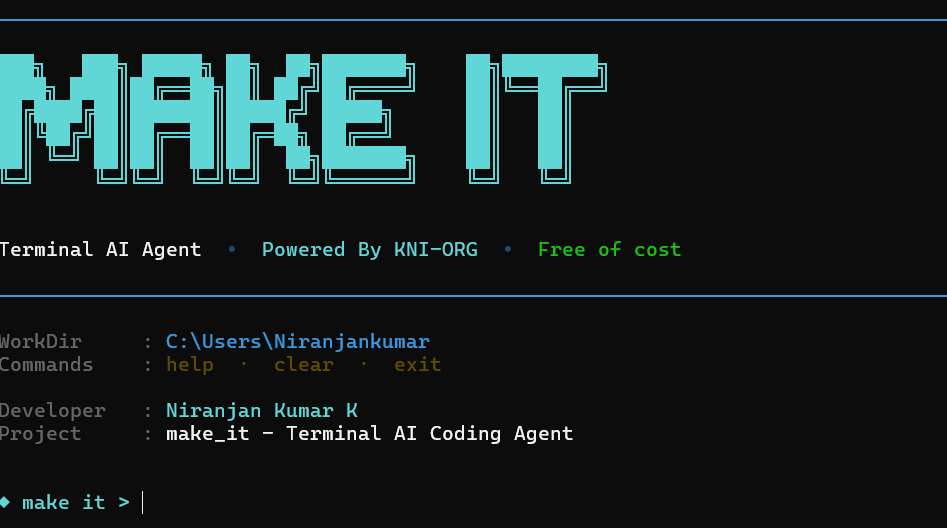
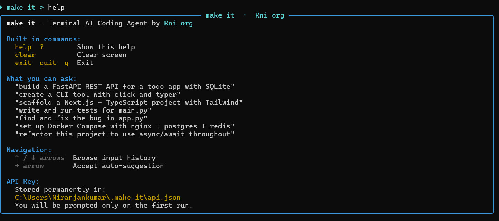
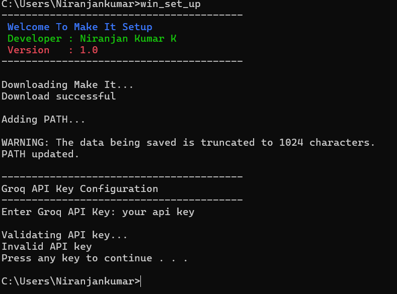

<div align="center">


# ⚡ Make It

### Terminal AI Coding Agent

**Tell it what to build — it makes it.** Create projects, edit files, run commands, and write code right from your terminal, powered by the **AI Engine**.

[](https://hacker1514.github.io/make_it/download/)
[](LICENSE)
[](download.html)
[](download.html)
[](https://github.com/hacker1514)

**By [Niranjan Kumar K](https://github.com/hacker1514) · KNI-ORG**

[🚀 Download](download.html) · [📖 Docs](docs.html) · [✨ Features](features.html) · [📸 Screenshots](screenshots.html) · [❓ FAQ](faq.html)

</div>

---

## 🌟 About

**Make It** is a terminal-based AI coding agent that combines the power of artificial intelligence with practical file-system operations, command execution, and project scaffolding. It's the pair programmer you always wanted — fast, reliable, and always available.

Born from a simple observation: *developers spend too much time on repetitive tasks an AI could handle.* With Make It, you describe what you want and the AI builds it — no complex configuration, no steep learning curve, just **describe, and it's done**.

> ⚡ **High Performance** — powered by an intelligent dual AI engine architecture.

---

## ✨ Features

| Feature | Description |
| :--- | :--- |
| 🧠 **AI Coding** | Write, refactor, and debug code in any language using natural language. |
| ✏️ **File Editing** | Make precise edits across multiple files with a single instruction. |
| 📦 **Project Generator** | Generate full project scaffolds from a single prompt. |
| 🖥️ **Command Execution** | Run terminal commands safely with approval. |
| 💾 **Memory** | Remembers your project context across sessions. |
| 🎨 **Rich Terminal** | Beautiful interactive terminal with syntax highlighting & streaming output. |
| 🪟 **Cross Platform** | Windows, Linux, macOS, WSL, and Termux — everywhere you code. |
| ⚡ **Dual AI Engine** | Multi-AI fallback architecture for ultra-reliable uptime. |
| 🚀 **Fast Responses** | Instant responses with no complex setup. |
| 🧩 **Open Source** | Free, MIT-licensed, and community-driven. |

---

## 📸 Screenshots

<div align="center">

| Terminal Agent | Project Generation | Setup Experience |
| :---: | :---: | :---: |
|  |  |  |

</div>

> More screenshots: [Screenshots Gallery](screenshots.html)

---

## 🚀 Quick Start

### Prerequisites

- A modern OS: **Windows 10/11, Linux, macOS 12+, WSL 2**, or **Termux**
- `curl` (pre-installed on most systems)

### Install

Choose your platform and copy the command:

#### 🪟 Windows

```bat
curl -L https://hacker1514.github.io/make_it/scripts/win_set_up.bat -o win_set_up.bat && win_set_up
```

#### 🐧 Linux / Ubuntu / Debian / Fedora / Arch

```bash
curl -L https://hacker1514.github.io/make_it/scripts/linux_set_up.sh -o linux_set_up.sh && chmod +x linux_set_up.sh && ./linux_set_up.sh
```

#### 🍎 macOS

```bash
curl -L https://hacker1514.github.io/make_it/scripts/mac_set_up.sh -o mac_set_up.sh && chmod +x mac_set_up.sh && ./mac_set_up.sh
```

#### 🪟➡️🐧 WSL

```bash
curl -L https://hacker1514.github.io/make_it/scripts/wsl_set_up.sh -o wsl_set_up.sh && chmod +x wsl_set_up.sh && ./wsl_set_up.sh
```

#### 📱 Termux (Android)

```bash
curl -L https://hacker1514.github.io/make_it/scripts/termux_set_up.sh -o termux_set_up.sh && chmod +x termux_set_up.sh && ./termux_set_up.sh
```

### ▶️ Usage

```bash
makeit
```

Start an interactive session:

```
> makeit "create a flask API with SQLite and user authentication"
```

| Command | Description |
| :--- | :--- |
| `makeit` | Start an interactive AI session |
| `makeit "your instruction"` | Run a one-shot instruction |
| `makeit --reset` | Reset the memory system |

---

## 🛠️ Tool System

Make It provides the AI agent with a set of tools to interact with your system:

| Tool | Purpose |
| :--- | :--- |
| 📄 `read_file` | Read the contents of a file |
| ✏️ `write_file` | Create or overwrite a file with new content |
| 🔍 `search_files` | Search for patterns across files using regex |
| 📋 `list_files` | List files in a directory |
| ⚡ `run_command` | Execute a terminal command |
| 🗑️ `delete_file` | Delete a file or empty directory |
| 📦 `create_project` | Scaffold an entire project structure |

Each tool is a Python function with a clear schema the AI understands.

---

## 🧠 Memory System

Make It remembers your project context across sessions:

- 💬 **Conversation History** — coherent multi-turn conversations
- 📁 **Project Context** — project structure, recent files, important variables
- 💾 **Persistent Storage** — stored in `~/.make_it/history.json`

---

## 📄 License

**Make It** is licensed under the [MIT License](LICENSE). Free to use, modify, and distribute.

---

## 📬 Contact

<div align="center">

[](https://github.com/hacker1514)
[](mailto:hackerenvironment1514@gmail.com)

</div>

---

<div align="center">

**Made with ❤️ by [Niranjan Kumar K](https://github.com/hacker1514) · KNI-ORG**

© 2026 Niranjan Kumar K. All rights reserved.

</div>
